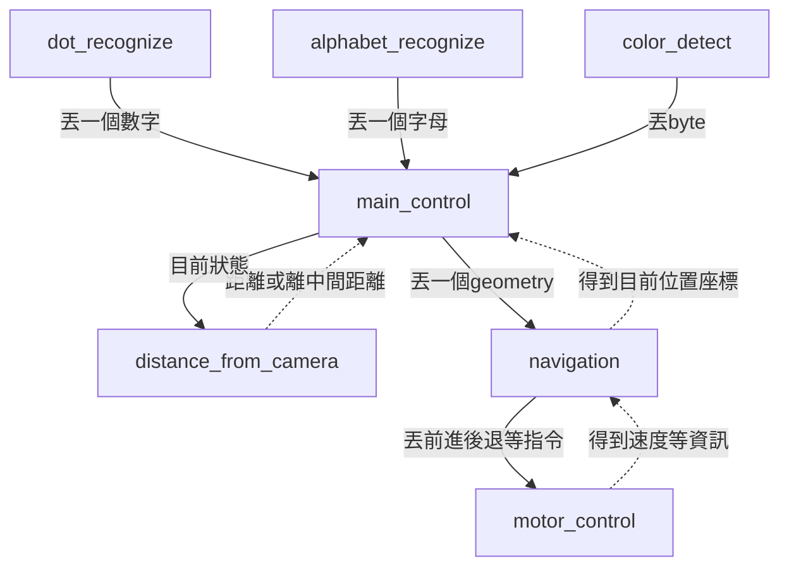
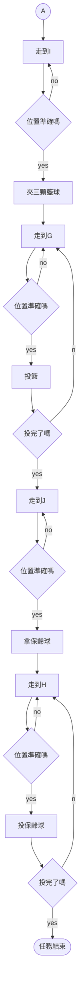

# TDK-2022

This is a repository for TDK-2022 competition.

[第 26 屆 TDK 盃全國大專校院創思設計與製作競賽 【自動組】競賽規則](https://tdk.stust.edu.tw/upload/news/files/26th%20TDK%E7%9B%83%E8%87%AA%E5%8B%95%E7%B5%84%E7%AB%B6%E8%B3%BD%E8%A6%8F%E5%89%87.pdf)

## meeting notes

You can find meeting notes here:

[iTron - HackMD](https://hackmd.io/team/iTron-robotics-team?nav=overview)

## Missions

- Alphabet Recognition: use opencv to detect contours

## Node Graph

- 目前狀態為一個字串，代表需要掃描的東西
  - `"alphabet"`
  - `"basketball"`
  - `"bowling"`
  - `"dot"`
- 距離或離中間距離代表會回傳以下東西
  - 一個距離(數字)
  - 距離代表的意義
    - 物體不在中間，`"attitude adjustment"`
    - 物體在中間，`"distance detect"`

## Flowchart

