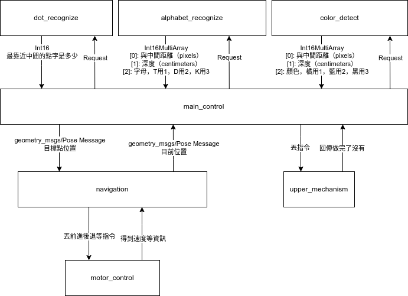

# TDK-2022

This is a repository for TDK-2022 competition.

[第 26 屆 TDK 盃全國大專校院創思設計與製作競賽 【自動組】競賽規則](https://tdk.stust.edu.tw/upload/news/files/26th%20TDK%E7%9B%83%E8%87%AA%E5%8B%95%E7%B5%84%E7%AB%B6%E8%B3%BD%E8%A6%8F%E5%89%87.pdf)

## meeting notes

You can find meeting notes here:

- [iTron - HackMD](https://hackmd.io/team/iTron-robotics-team?nav=overview)
- [進度管理 - google drive](https://docs.google.com/document/d/12E3JFJpEgetsssrI30uEMVVPmBOBpHAHNQxU621Bsxs/edit?usp=sharing)
- [週開會內容 - google drive](https://docs.google.com/document/d/13ywQ8dXawGymXWrEQWETpR7VzdLqom0b-slnPKrO5q8/edit?usp=sharing)

## Node Graph

## Flowchart

```mermaid
graph TD
	%% point reached
    A(["A點(起點)"])
    A1(["A點(起點)"])
    I[/"I點(籃球取球點)"/]
    I1[/"I點(籃球取球點)"/]
    G[/"G點(籃球投籃點)"/]
    G1[/"G點(籃球投籃點)"/]
    J[/"J點(保齡球取球點)"/]
    J1[/"J點(保齡球取球點)"/]
    H[/"H點(保齡球投球點)"/]
    H1[/"H點(保齡球投球點)"/]
	
	%% main ask navigation server to move
	main2navI["丟 I 點座標到 navigation"]
	main2navG["丟 G 點座標到 navigation"]
	main2navJ["丟 J 點座標到 navigation"]
	main2navH["丟 H 點座標到 navigation"]
	adjustPos["丟修正geometry到navigation"]
	adjustPos2["丟修正geometry到navigation"]
	adjustPos3["丟修正geometry到navigation"]
	adjustPos4["丟修正geometry到navigation"]
	
	%% publish stages
    mainPubStage1["publish stage 1"]
	mainPubStage2["publish stage 2"]
	mainPubStage3["publish stage 3"]
	mainPubStage4["publish stage 4"]
	
	%% read from distance from camera node
    disFromCam[/"讀取distance_from_camera"/]
    disFromCam2[/"讀取distance_from_camera"/]
    disFromCam3[/"讀取distance_from_camera"/]
    disFromCam4[/"讀取distance_from_camera"/]
	
	%% determine whether distance is right or not
    disCheck{"距離是否正確?"}
    disCheck2{"距離是否正確?"}
    disCheck3{"距離是否正確?"}
    disCheck4{"距離是否正確?"}
	
	%% get ball, throw ball movement
    getBasketball["取籃球(三次) (TODO: 未決定node)"]
	throwBasketball["投籃球(三次) (TODO: 未決定node)"]
	getBowling["取保齡球(三次) (TODO: 未決定node)"]
	throwBowling["丟保齡球(三次) (TODO: 未決定node)"]

	%% --------------------------------------

    A --"stage 1"--> 
	I --"stage 2"-->
    G --"stage 3"-->
    J --"stage 4"-->
	H
	
	%% ---------------------------------------
	
    subgraph "main_control node"
	
	%% stage 1 起點到取球點並取球
    A1    			--"進入 stage 1"-->
    mainPubStage1 	-->
    main2navI 		-->
    I1 				-->
    disFromCam
	disFromCam 		-->
	disCheck 		--"Yes" --> 
	getBasketball
	disCheck 		--"No" -->
	adjustPos 		--> 
	disFromCam
	
	%% stage 2 到達投籃點並投籃
	getBasketball 	-- "進入 stage 2" -->
	mainPubStage2 	-->
	main2navG 		-->
	G1 				-->
	disFromCam2 	-->
	disCheck2 		--"Yes"--> 
	throwBasketball
	disCheck2 		--"No"-->
	adjustPos2 		--> 
	disFromCam2
	
	%% stage 3 到達取保齡球點並取保齡球
	throwBasketball --"進入 stage 3"-->
	mainPubStage3 	-->
	main2navJ 		-->
	J1 				-->
	disFromCam3 	-->
	disCheck3		--"Yes"-->
	getBowling
	disCheck3 		--"No"-->
	adjustPos3		-->
	disFromCam3
	
	%% stage 4 到達投保齡球點並丟出保齡球
	getBowling 		--"進入 stage 4"-->
	mainPubStage4 	-->
	main2navH		-->
	H1				-->
	disFromCam4		-->
	disCheck4		--"Yes"-->
	throwBowling
	disCheck4		--"No"-->
	adjustPos4		-->
	disFromCam4
	
    end
```

